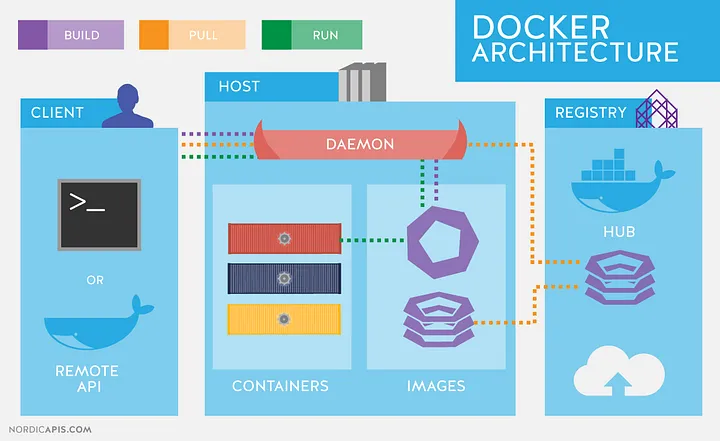

## Introdução
Docker é uma plataforma que permite criar, testar e executar aplicações em "containers". Um container é como uma pequena máquina virtual, mas muito mais leve, porque compartilha o mesmo sistema operacional com outros containers, utilizando apenas os recursos necessários para rodar uma aplicação específica.


### Aqui estão os conceitos básicos:


1. **Dockerfile**: Arquivo de texto com comandos e instruções que ajuda a criar as imagens e especifíca o que a aplicação precisa para funcionar, automatiza a criação do ambiente.

2. **Imagem**: É um pacote que contém tudo o que a aplicação precisa para funcionar, como o código, bibliotecas e dependências. A imagem é como um modelo a partir do qual os containers são criados.

3. **Container**: É uma instância em execução de uma imagem. Quando você inicia uma imagem, você cria um container. Os containers são isolados, ou seja, eles funcionam de forma independente e não interferem uns nos outros.

4. **Volume**s: São utilizados para persistir dados fora do ciclo de vida dos contêineres. Eles permitem que os contêineres compartilhem dados ou mantenham dados ao longo de diferentes execuções (mesmo que o contêiner seja destruído e recriado).

5. **Networks**/Redes: São usadas para permitir a comunicação entre contêineres, e entre contêineres e o mundo exterior. Docker cria automaticamente uma rede "bridge" padrão, mas você pode criar suas próprias redes personalizadas.

6. **Docker Hub/Registries**: Um repositório online onde você pode armazenar e baixar imagens Docker.

## Vantagens do Docker

- **Portabilidade**: Como os containers têm tudo que a aplicação precisa, você pode rodar a mesma aplicação em qualquer lugar (no seu computador, no servidor, etc.).
- **Isolamento**: Cada container é isolado, o que evita conflitos de dependências entre aplicações.
- **Eficiência**: Containers são mais leves e rápidos que máquinas virtuais, consumindo menos recursos do sistema.
- **Facilidade de integração** em pipelines CI/CD, o que é uma das razões principais para o uso do Docker em DevOps

## Funcionamento do docker



O Docker funciona como uma plataforma de virtualização leve baseada em contêineres, permitindo que desenvolvedores empacotem, distribuam e executem aplicativos isolados do sistema operacional subjacente. Aqui está uma visão geral de como o Docker funciona:

### 1. **Imagens e Contêineres**

- **Imagem**: Uma imagem Docker é um pacote que contém todos os arquivos e dependências necessários para executar um aplicativo. É imutável, o que significa que uma vez criada, não pode ser modificada. Imagens são construídas a partir de um arquivo chamado **Dockerfile**, que define as instruções passo a passo para configurar o ambiente.
- **Contêiner**: Quando você executa uma imagem, ela se torna um contêiner. O contêiner é uma instância da imagem, em execução e isolada, com seu próprio sistema de arquivos, bibliotecas e código. Ele oferece um ambiente isolado para rodar o aplicativo.

### 2. **Isolamento e Virtualização de Contêineres**

Docker utiliza dois conceitos fundamentais para isolar os contêineres:

- **Namespaces**: Eles garantem que cada contêiner tenha uma visão isolada de recursos do sistema, como processos, rede e IDs de usuários. Isso permite que um contêiner não interfira em outro.
- **Cgroups (Control Groups)**: Fornecem controle sobre os recursos utilizados pelos contêineres, como CPU, memória e E/S de disco. Assim, cada contêiner usa apenas os recursos que lhe são permitidos.

### 3. **Docker Engine**

O **Docker Engine** é o núcleo do Docker, um daemon que roda no host e gerencia a criação, execução e remoção de contêineres. Ele tem três componentes principais:

- **Servidor (Docker Daemon)**: Executa as imagens e gerencia os contêineres.
- **API**: Uma interface que permite que programas se comuniquem com o Docker Daemon.
- **CLI (Interface de Linha de Comando)**: O cliente que envia comandos para o Docker Daemon (por exemplo, para iniciar um contêiner, construir uma imagem, etc.).

### 4. **Armazenamento e Volumes**

Contêineres por si só são efêmeros, ou seja, quando um contêiner é removido, todos os dados armazenados internamente são perdidos. Para persistir dados, o Docker utiliza **volumes**. Volumes são montados no sistema de arquivos do host e podem ser compartilhados entre contêineres. Isso garante que os dados permaneçam disponíveis mesmo após a destruição de um contêiner.

### 5. **Redes**

O Docker gerencia redes para permitir que os contêineres se comuniquem entre si e com o mundo externo. Existem vários drivers de rede disponíveis:

- **Bridge**: A rede padrão, que isola os contêineres, permitindo que eles se comuniquem uns com os outros.
- **Host**: O contêiner compartilha a rede do host.
- **Overlay**: Permite que contêineres em diferentes hosts Docker se comuniquem, geralmente utilizado em clusters.

### 6. **Registro de Imagens (Registry)**

As imagens são armazenadas em registros, como o **Docker Hub**, que é o repositório público oficial. Quando você faz o "pull" de uma imagem, o Docker busca essa imagem de um registro. As empresas podem também configurar seus próprios registros privados para armazenar suas imagens.

### 7. **Ciclo de Vida do Contêiner**

- **Criação**: Um contêiner é criado a partir de uma imagem.
- **Execução**: O contêiner é executado, fornecendo um ambiente isolado para rodar o aplicativo.
- **Interação**: O usuário pode interagir com o contêiner por meio de comandos como `docker exec`, `docker logs`, etc.
- **Parada e Remoção**: Quando o contêiner cumpre seu propósito, ele pode ser parado e removido, liberando recursos.

### 8. **Docker Compose**

O **Docker Compose** é uma ferramenta que permite definir e gerenciar múltiplos contêineres em um arquivo YAML. Com ele, é possível automatizar a criação e execução de ambientes multicontêiner (ex.: um servidor web, banco de dados e cache, todos interagindo).

### Resumo do Funcionamento:

1. **Criação de uma Imagem**: Você cria uma imagem usando um Dockerfile, que contém todas as instruções e dependências necessárias.
2. **Execução de um Contêiner**: A partir da imagem, o Docker cria um contêiner, que é uma instância isolada.
3. **Isolamento**: Cada contêiner é isolado dos outros, garantindo que o ambiente de execução seja seguro e consistente.
4. **Comunicação e Persistência**: Contêineres podem se comunicar via redes configuradas e armazenar dados usando volumes.
5. **Escalabilidade**: O Docker facilita a escalabilidade horizontal, permitindo a execução de vários contêineres de forma eficiente.

Esse ciclo simples torna o Docker uma ferramenta poderosa para o desenvolvimento, teste e deploy de aplicativos de maneira consistente e confiável.

## Dockerfile

Exemplo de criação de dockerfile:
```
# Escolher a imagem base
FROM python:3.9-slim

# Informações do autor (Opcional)
LABEL maintainer="dev@exemplo.com"

# Definir o diretório de trabalho
WORKDIR /app

# Copiar o conteúdo da pasta local para o container
COPY . /app

# Instalar as dependências do projeto
RUN pip install -r requirements.txt

# Expor a porta em que a aplicação vai rodar
EXPOSE 5000

# Comando para rodar a aplicação
CMD ["python", "app.py"]
```

#### Construíndo a imagem através do docker file:
```
docker build -t "Nome da imagem:tag" .
```

- **docker build**: Comando para construir a imagem
- **-t "Nome da imagem:tag"**: -t de  "Tag" para poder dar um nome e uma tag para a imagem, exemplo de tag: latast, 1.0, dev.
- **.**:  Caso o dockerfile esteja na pasta onde está sendo executado o comando é necessário apenas utilizar "ponto", caso contrario deve ser informado o local do dockerfile.

```
docker build -t myapp:1.0 .
```

Para verificar a imagem que foi construída pode ser executado o comando "docker images"

| REPOSITORY | TAG  | IMAGE ID     | CREATED           | SIZE  |
|------------|------|--------------|-------------------|-------|
| myapp      | 1.0  | abc123456789 | 2 minutes ago     | 120MB |


#### Executando o Container:
```
docker run -d -p porta:porta --name "Nome do Container" "Nome da Imagem"
```
- **docker run:** Iniciar novo container
- **-d**: detached mode para não travar o terminal
- **-p porta:porta**: faz o mapeamento entre o host (maquina executando docker) e o container. Primeiro referente ao host e o segundo ao container.
- **--name "nome do container"**: Ao invés de deixar o docker gerar um nome aleatório é só utilizar esse parâmetro para informar o nome do container.
- **"nome da imagem"**:  informa a imagem que contém de onde o container puxa as informações para ser criado.

```
docker run -d -p 5000:5000 --name my-container myapp
```
Para verificar o container executado pode usar o comando "docker ps", vai mostrar no terminal as seguintes informações:

| CONTAINER ID | IMAGE | COMMAND | CREATED | STATUS | PORTS | NAMES
| ------------------ | ------- | ------------ | ----------- | ------- | ------ | -------
| c3f3b9e77f15 | myapp:1.0 | "/app/start.sh" | 2 minutes ago | Up 2 minutes | 0.0.0.0:5000->5000/tcp | my-container

- **CONTAINER ID**:
    - Um identificador único gerado pelo Docker para cada container em execução. No exemplo, `c3f3b9e77f15`
- **IMAGE**:
    - A imagem a partir da qual o container foi criado. No exemplo, `myapp:1.0`
- **COMMAND**:
    - O comando que está sendo executado dentro do container. Por exemplo, `"/app/start.sh"`.
- **CREATED**:
    - O tempo decorrido desde que o container foi criado. Por exemplo, `2 minutes ago`.
- **STATUS**:
    - O estado atual do container. `Up` indica que o container está em execução, seguido de quanto tempo está ativo. Por exemplo, `Up 2 minutes`.
- **PORTS**:
    - As portas mapeadas entre o host e o container. O formato é `host_port:container_port`. Por exemplo, `0.0.0.0:5000->5000/tcp`.
- **NAMES**:
    - O nome do container. Se você não especificar um nome, o Docker gera um nome aleatório. No exemplo, `my-container`.

## docker-compose.yaml
### Comandos Relevantes com `docker-compose up` e `docker-compose down`

### Subir os serviços (básico):
```bash
docker-compose up
```
Este comando sobe todos os serviços definidos no arquivo `docker-compose.yaml`.

### Rodar em segundo plano (detached mode):
```bash
docker-compose up -d
```
Executa os serviços em segundo plano, permitindo que o terminal fique livre para outros comandos.

### Forçar o rebuild das imagens:
```bash
docker-compose up --build
```
Força a recompilação das imagens antes de subir os serviços, útil quando você altera o Dockerfile ou o código da aplicação.

### Recriar contêineres se necessário:
```bash
docker-compose up --force-recreate
```
Recria os contêineres mesmo se não houver alterações nos serviços ou volumes.

### Especificar um serviço:
```bash
docker-compose up web
```
Sobe apenas o serviço especificado, neste caso, `web`. Você pode usar o nome de qualquer serviço definido no `docker-compose.yaml`.

## Comandos Relevantes com `docker-compose down`:

### Derrubar todos os serviços e remover contêineres:
```bash
docker-compose down
```
Para e remove todos os contêineres criados com o `docker-compose up`.

### Remover volumes junto com os contêineres:
```bash
docker-compose down -v
```
Remove também os volumes associados aos serviços, como volumes de dados do banco de dados. Use com cuidado, pois isso pode resultar na perda de dados armazenados nos volumes.

### Remover imagens:
```bash
docker-compose down --rmi all
```
Remove também as imagens usadas pelos serviços. Isso é útil para liberar espaço, mas o próximo `up` terá que recriar todas as imagens.

### Remover redes:
```bash
docker-compose down --remove-orphans
```
Remove contêineres de serviços que não estão mais definidos no `docker-compose.yaml`, mas que ainda estão rodando.

## Outros Comandos Úteis:

### Visualizar os logs em tempo real:
```bash
docker-compose logs -f
```
Segue os logs de todos os serviços, permitindo que você veja o que está acontecendo em tempo real.

### Parar todos os serviços sem removê-los:
```bash
docker-compose stop
```
Para os serviços, mas não remove os contêineres ou redes, permitindo retomar com `docker-compose start`.

### Reiniciar serviços:
```bash
docker-compose restart
```
Reinicia os serviços sem derrubar ou recriar os contêineres.


### Arquivo yaml
```yaml
version: '3.8'

services:
  web:
    image: node:14  # (Obrigatório) Define a imagem Node.js versão 14
    container_name: my_node_app  # (Opcional) Nome do contêiner
    working_dir: /usr/src/app  # (Opcional) Diretório de trabalho no contêiner
    volumes:
      - ./:/usr/src/app  # (Opcional) Monta o diretório atual no contêiner
    ports:
      - "3000:3000"  # (Obrigatório) Exposição da porta 3000
    environment:
      - NODE_ENV=development  # (Opcional) Define a variável de ambiente
    command: "npm start"  # (Obrigatório) Comando para iniciar o app Node.js
    depends_on:
      db:
        condition: service_healthy  # (Opcional) Aguarda o serviço 'db' estar saudável antes de iniciar
    healthcheck:
      test: ["CMD-SHELL", "curl -f http://localhost:3000 || exit 1"]  # (Opcional) Verificação de saúde do serviço
      interval: 30s  # (Opcional) Intervalo entre checagens
      timeout: 10s  # (Opcional) Tempo limite para resposta
      retries: 3  # (Opcional) Tentativas antes de marcar como unhealthy
    restart: always  # (Opcional) Reinicia automaticamente em caso de falha

  db:
    image: postgres:13  # (Obrigatório) Define a imagem PostgreSQL versão 13
    container_name: my_postgres_db  # (Opcional) Nome do contêiner
    environment:
      POSTGRES_USER: myuser  # (Obrigatório) Nome de usuário do banco de dados
      POSTGRES_PASSWORD: mypassword  # (Obrigatório) Senha do banco de dados
      POSTGRES_DB: mydatabase  # (Obrigatório) Nome do banco de dados
    volumes:
      - postgres_data:/var/lib/postgresql/data  # (Opcional) Volume para persistência de dados
    ports:
      - "5432:5432"  # (Obrigatório) Exposição da porta 5432 para o banco
    healthcheck:
      test: ["CMD-SHELL", "pg_isready -U myuser"]  # (Opcional) Verificação de saúde do PostgreSQL
      interval: 30s  # (Opcional) Intervalo entre checagens
      timeout: 10s  # (Opcional) Tempo limite para resposta
      retries: 5  # (Opcional) Tentativas antes de marcar como unhealthy
    restart: always  # (Opcional) Reinicia automaticamente em caso de falha

volumes:
  postgres_data:  # (Opcional) Volume nomeado para armazenamento de dados
```

### Explicação:

#### Obrigatório:
- **version**: A versão do Compose (3.8 neste caso) é necessária para definir a sintaxe do arquivo.
- **services**:
  - **image**: A imagem para cada serviço é obrigatória para definir o ambiente de execução.
  - **ports**: Definir as portas mapeadas é necessário para expor os serviços externamente.
  - **command**: O comando de execução (no caso do Node.js, `npm start`).
  - **environment (db)**: Nome de usuário, senha e banco de dados são obrigatórios para configurar o serviço PostgreSQL.

#### Opcional:
- **container_name**: Define um nome para o contêiner, caso não queira que o Docker gere um automaticamente.
- **volumes**: Montar volumes é opcional, mas recomendado para persistir dados fora dos contêineres.
- **depends_on**: Controla a ordem de inicialização dos serviços. O `condition: service_healthy` garante que o serviço Node.js só inicie quando o PostgreSQL estiver pronto.
- **healthcheck**: Verifica a saúde dos serviços periodicamente para reiniciá-los em caso de falha.
- **restart**: A política de reinicialização garante que os serviços sejam reiniciados automaticamente após falhas.
- **environment (web)**: Variáveis de ambiente, como `NODE_ENV`, podem ser configuradas para alterar o comportamento da aplicação.

## Documentação Auxiliar
https://docs.docker.com/

https://praveendandu24.medium.com/understanding-docker-architecture-an-in-depth-overview-of-docker-components-and-usage-f1a26bd217f9

https://www.youtube.com/watch?v=ntbpIfS44Gw